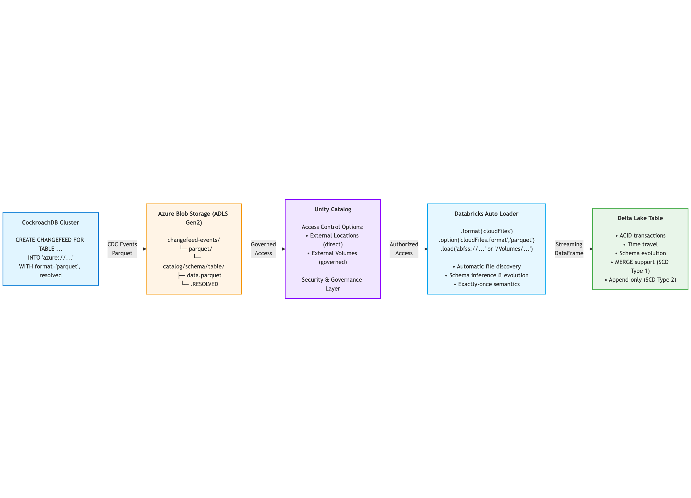

# Stream a CockroachDB Changefeed to Databricks (Azure Edition)

*By Robert Lee | Updated February 4, 2026*

---

## Overview

This guide shows how to stream CockroachDB data to Databricks using CockroachDB changefeeds, Azure Blob Storage, and Delta Lake. The pipeline captures both initial snapshots and ongoing changes (inserts, updates, deletes) from CockroachDB and makes them available in Databricks for analytics and applications.

CockroachDB changefeeds natively generate snapshot and CDC records in Parquet format to Azure Blob Storage. Databricks Auto Loader reads the Parquet files into a streaming DataFrame, Spark transforms the CDC events, and Delta Lake writes them as streaming tables with ACID guarantees.

**Multi-table transactional consistency** is achieved using CockroachDB's RESOLVED timestamp watermarks as authoritative high-water marks: each table's RESOLVED file (written by CockroachDB changefeeds) guarantees that all CDC events up to that timestamp are complete, including all column family fragments. By coordinating ingestion across multiple tables using a shared minimum watermark, you maintain referential integrity and ensure all tables are synchronized to the same transactional point in time, preventing partial transaction visibility and data inconsistencies.

**What Databricks handles natively:**
- ✅ **SCD Type 1** (target maintains latest INSERT/UPDATE/DELETE state via MERGE INTO)
- ✅ **SCD Type 2** (target stores all INSERT/UPDATE/DELETE events as rows for full history)
- ✅ **Column families** (CockroachDB's `split_column_families` for write-heavy concurrent workloads)
- ✅ **Multi-table transaction consistency** (atomic commits coordinated across tables with CockroachDB RESOLVED timestamp watermarks)
- ✅ **Schema evolution** (automatic schema inference and merging)
- ✅ **Multiple CockroachDB changefeed formats to blob storage** (Parquet, JSON, Avro, CSV)

This guide focuses on **Parquet format** for native Delta Lake integration. Parquet is CockroachDB's recommended format for cloud storage changefeeds.

---

## Getting Started

### Step 1. Create a table *(CockroachDB)*

```sql
CREATE TABLE usertable (
    ycsb_key INT PRIMARY KEY,
    field0 TEXT,
    field1 TEXT,
    field2 TEXT
);
```

### Step 2. Create a changefeed *(CockroachDB → Azure)*

Stream changes to Azure Blob Storage as Parquet files:

```sql
CREATE CHANGEFEED FOR TABLE usertable
INTO 'azure://changefeed-events/parquet/defaultdb/public/usertable/usertable_cdc/?AZURE_ACCOUNT_NAME={storage_account_name}&AZURE_ACCOUNT_KEY={storage_account_key}'
WITH 
    format='parquet',
    updated,
    resolved='10s';  -- ✅ Critical for data consistency (see RESOLVED Timestamps section)
```

**Note:** The `resolved='10s'` option is **required for production** workloads with column families or multi-table consistency requirements. It ensures all CDC events and column family fragments are complete before processing.

The CockroachDB changefeed will write Parquet files to Azure in this structure:
```
changefeed-events/parquet/defaultdb/public/usertable/usertable_cdc/
  ├── 2026-01-28/
  │   ├── 202601281910402079962990000000000-abc123.parquet  (data files)
  │   ├── 202601281910500000000000000000000.RESOLVED        (watermark - guarantees completeness)
  └── ...
```

### Step 3. Insert data *(CockroachDB)*

```sql
INSERT INTO usertable (ycsb_key, field0, field1, field2)
VALUES 
    (1, 'value_1_0', 'value_1_1', 'value_1_2'),
    (2, 'value_2_0', 'value_2_1', 'value_2_2');
```

The CockroachDB changefeed automatically captures these changes and writes them to Azure Blob Storage.

### Step 4. Configure Unity Catalog access to Azure *(Databricks)*

Create an External Volume for governed, credential-free access to your Azure storage:

```sql
-- 1. Create storage credential (one-time setup)
CREATE STORAGE CREDENTIAL azure_cdc_credential
WITH (AZURE_SERVICE_PRINCIPAL
  '<client-id>',
  '<directory-id>',
  '<client-secret>'
);

-- 2. Create external location pointing to your container
CREATE EXTERNAL LOCATION azure_cdc_location
URL 'abfss://changefeed-events@{storage_account}.dfs.core.windows.net/'
WITH (STORAGE CREDENTIAL azure_cdc_credential);

-- 3. Create external volume
CREATE EXTERNAL VOLUME cdc_volume
LOCATION azure_cdc_location;
```

Now you can access CDC files using: `/Volumes/catalog/schema/cdc_volume/parquet/...`

See [Connect to cloud object storage using Unity Catalog](https://learn.microsoft.com/en-us/azure/databricks/connect/unity-catalog/cloud-storage/) for detailed setup instructions.

### Step 5. Stream into Databricks Delta Lake - Append-Only *(Databricks)*

Use Databricks Auto Loader to automatically ingest CDC files in append-only mode (SCD Type 2):

```python
from pyspark.sql import functions as F

# Read CDC events from Azure (Auto Loader automatically discovers new files)
raw_df = (spark.readStream
    .format("cloudFiles")
    .option("cloudFiles.format", "parquet")
    .option("cloudFiles.schemaLocation", "/checkpoints/usertable_cdc/schema")
    .option("pathGlobFilter", "*usertable*.parquet")  # Exclude .RESOLVED files
    .option("recursiveFileLookup", "true")
    .load("abfss://changefeed-events@{storage_account}.dfs.core.windows.net/parquet/defaultdb/public/usertable/usertable_cdc/")
)

# Transform CockroachDB CDC format to Delta Lake
# Note: __crdb__updated is HLC format '1234567890123456789.0000000001' (wall_time.logical)
# The connector (cockroachdb_autoload) produces _cdc_timestamp_nanos (bigint) + _cdc_timestamp (string, nanosecond display).
# Manual pipeline example below uses second precision; for nanos use extract wall time and from_unixtime with .SSSSSSSSS.
df = raw_df.select(
    "*",
    F.from_unixtime(F.split(F.col("__crdb__updated"), "\\.")[0].cast("bigint") / 1000000000).cast("timestamp").alias("_cdc_timestamp"),
    F.when(F.col("__crdb__event_type") == "d", "DELETE").otherwise("UPSERT").alias("_cdc_operation")
).drop("__crdb__updated", "__crdb__event_type")

# Write to Delta Lake (append-only: target stores full history)
query = (df.writeStream
    .format("delta")
    .option("checkpointLocation", "/checkpoints/usertable_cdc/data")
    .option("mergeSchema", "true")
    .trigger(availableNow=True)
    .toTable("main.default.usertable_cdc")
)

query.awaitTermination()
```

### Step 6. Query your data *(Databricks)*

```sql
SELECT ycsb_key, field0, _cdc_operation, _cdc_timestamp 
FROM main.default.usertable_cdc 
ORDER BY _cdc_timestamp;
```

```
+--------+-----------+--------------+-------------------+
|ycsb_key|field0     |_cdc_operation|_cdc_timestamp     |
+--------+-----------+--------------+-------------------+
|1       |value_1_0  |UPSERT        |2026-01-28 19:10:00|
|2       |value_2_0  |UPSERT        |2026-01-28 19:10:00|
+--------+-----------+--------------+-------------------+
```

**That's it!** You just implemented **append-only ingestion** (SCD Type 2) where the target table stores all CDC events (INSERT, UPDATE, DELETE) as rows for full history tracking.

### Want more CDC capabilities?

The complete working notebook (`sources/cockroachdb/docs/cockroachdb-cdc-tutorial.ipynb`) includes examples for both CDC modes with standard tables and CockroachDB column families:

| CDC Mode | Target Behavior | Use Case | Column Family Examples |
|----------|-----------------|----------|----------------------|
| **append_only** | All INSERT, UPDATE, DELETE events stored as rows | Full history (audit logs, compliance) | ✅ single_cf, multi_cf |
| **update_delete** | Latest INSERT/UPDATE/DELETE state only (MERGE INTO) | Current values (dashboards, reporting) | ✅ single_cf, multi_cf |

**CockroachDB Column Family Support:**

CockroachDB [column families](https://www.cockroachlabs.com/docs/stable/column-families) group columns into separate key-value pairs to optimize write performance in concurrent workloads. When using `split_column_families` in changefeeds, CockroachDB generates multiple Parquet files per row update (one per column family), and the connector automatically merges these fragments.

- **single_cf**: Standard tables (one column family, default behavior)
  - Changefeed: `WITH format='parquet', updated, resolved='10s'`
  - One Parquet file per CDC event
  
- **multi_cf**: Tables with column families split (`split_column_families`)
  - Changefeed: `WITH format='parquet', split_column_families, updated, resolved='10s'`
  - Multiple Parquet files per CDC event (fragments require merging)
  - Recommended for wide tables (50+ columns) with write-heavy concurrent access patterns

---

## Architecture



*The data flow from CockroachDB through Azure Blob Storage and Unity Catalog to Delta Lake using Databricks Auto Loader. 

---

## Beyond the Basics: Implementing UPDATE/DELETE Support

The example above stores all CDC events as rows in the target table (SCD Type 2). For applications that need the target to maintain current state only (SCD Type 1), use Delta Lake's MERGE INTO operation:

```python
from delta.tables import DeltaTable
from pyspark.sql import functions as F
from pyspark.sql.window import Window

# Two-stage approach (Serverless-compatible)
# Stage 1: Stream to staging (append-only)
raw_df.writeStream.toTable(f"{target_table}_staging")

# Stage 2: Apply MERGE from staging to final table
staging_df = spark.read.table(f"{target_table}_staging")

# Deduplicate to latest per key (use _cdc_timestamp_nanos when available for nanosecond ordering)
window_spec = Window.partitionBy("ycsb_key").orderBy(F.col("_cdc_timestamp").desc())
deduped_df = staging_df.withColumn("_row_num", F.row_number().over(window_spec)) \
    .filter(F.col("_row_num") == 1).drop("_row_num")

# Apply MERGE
delta_table = DeltaTable.forName(spark, target_table)
delta_table.merge(deduped_df, "target.ycsb_key = source.ycsb_key") \
    .whenMatchedUpdate(set={"*"}) \
    .whenMatchedDelete(condition="source._cdc_operation = 'DELETE'") \
    .whenNotMatchedInsert(values={"*"}) \
    .execute()
```

**Why two stages?** This follows the **Databricks Medallion Architecture** pattern:
- **Stage 1 (Streaming)** = Bronze layer - Raw CDC ingestion
- **Stage 2 (Batch MERGE)** = Silver layer - Cleaned, deduplicated data

Supported on all Databricks editions including Serverless and Lakeflow Spark Declarative Pipelines (SDP). Key benefits:
- **Performance** - Batch and deduplicate events, reducing MERGE operations and handling backpressure
- **Reliability** - Staging buffer enables retry if MERGE fails, preventing data loss
- **Observability** - Inspect raw CDC events and add business logic or data quality checks between stages

---

## Tables with Column Families

For tables with multiple column families (used for write-heavy concurrent workloads to reduce the number of write intents per transaction):

> ⚠️ **CRITICAL:** Always use `resolved` option with column families to guarantee fragment completeness. Without it, you risk writing incomplete rows with NULL values (data corruption). See [RESOLVED Timestamps](#resolved-timestamps-guaranteeing-data-consistency) section for details.

**1. Enable `split_column_families` and `resolved` in CockroachDB changefeed:**
```sql
CREATE CHANGEFEED FOR TABLE usertable_wide
INTO 'azure://...'
WITH 
    format='parquet',
    updated,
    split_column_families,  -- ← Generates multiple files per update
    resolved='10s',         -- ← ✅ REQUIRED to guarantee completeness
    initial_scan='yes';
```

**2. Merge fragments in Databricks:**
```python
from crdb_to_dbx import merge_column_family_fragments

# Merge column family fragments
df_merged = merge_column_family_fragments(
    df=raw_df,
    primary_key_columns=["ycsb_key"]
)

# Write to target
df_merged.writeStream.toTable(target_table)
```

**Note:** For complete CDC pipelines, use the higher-level ingestion functions:
```python
from crdb_to_dbx.cockroachdb_config import load_and_process_config
from crdb_to_dbx import ingest_cdc_with_merge_multi_family

config = load_and_process_config("config.json")
query = ingest_cdc_with_merge_multi_family(config=config, spark=spark)
```

The `merge_column_family_fragments` function groups by primary key and timestamp, then coalesces NULL values across fragments using PySpark aggregations.

**Why use column families?** Column families group columns into single key-value pairs, reducing the number of write intents per transaction for write-heavy concurrent workloads. With `split_column_families` enabled in CockroachDB changefeeds, CockroachDB generates multiple files per update (one per column family), so merging reconstructs complete rows.

---

## RESOLVED Timestamps: Guaranteeing Data Consistency

CockroachDB changefeeds with the `resolved` option write `.RESOLVED` files that guarantee all CDC events and column family fragments are complete up to a specific timestamp. This prevents data corruption from incomplete updates and enables multi-table consistency.

**When to use RESOLVED timestamps:**
- ✅ **Required:** Tables with multiple column families (`split_column_families`)
- ✅ **Recommended:** Multi-table CDC with referential integrity requirements
- ✅ **Optional:** Single-column-family tables (adds completeness guarantee)

### Using RESOLVED Timestamps with Auto Loader

```python
from crdb_to_dbx import ingest_cdc_with_merge_multi_family

# Configure changefeed with resolved option
# CREATE CHANGEFEED FOR TABLE usertable
# INTO 'azure://...'
# WITH format='parquet', updated, resolved='10s';

# Auto Loader with RESOLVED watermarking (default)
result = ingest_cdc_with_merge_multi_family(
    config=config,
    spark=spark
)
# Automatically uses latest RESOLVED timestamp for filtering
```

**What happens:**
1. Scans Azure for `.RESOLVED` files
2. Extracts latest watermark timestamp
3. Filters CDC events: `__crdb__updated <= watermark`
4. Guarantees all column family fragments are complete

---

## Next Steps

**Complete working notebook**: All CDC modes and examples are available in `crdb_to_dbx/cockroachdb-cdc-tutorial.ipynb`.

For multi-table coordination, column family details, and advanced usage examples, see the interactive tutorial notebook which includes:
- All CDC modes (append-only, update-delete)
- Both column family configurations (single_cf, multi_cf)
- RESOLVED watermarking examples
- Multi-table coordination patterns

**Learn more:**
- [CockroachDB Changefeed Documentation](https://www.cockroachlabs.com/docs/stable/create-changefeed)
- [Databricks Auto Loader](https://docs.databricks.com/ingestion/auto-loader/)
- [Delta Lake MERGE INTO](https://docs.databricks.com/delta/merge.html)

---

## Credits

**Author**: [Robert Lee](https://credentials.databricks.com/profile/robertlee941580/wallet), Field Engineer at Databricks

This guide was created with guidance from:
- [Andrew Deally](https://andrewdeally.medium.com/) - CockroachDB team for changefeed architecture and best practices

---

## License & Contributing

**License**: Apache 2.0

We welcome contributions to this CockroachDB CDC to Databricks connector. We use GitHub Issues to track community reported issues and GitHub Pull Requests for accepting changes.

See [LICENSE](../LICENSE) for the full Apache 2.0 license text.
